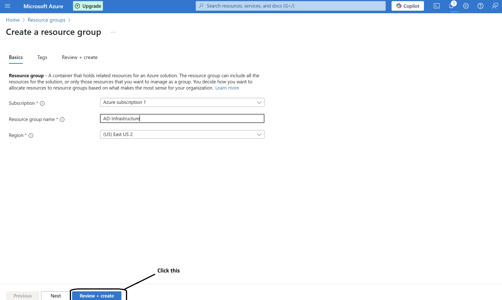

<table>
  <tr>
    <td>
      
    </td>
    <td>
      
    </td>
  </tr>
</table>

<h1 align="center">Deploying an Active Directory Infrastructure in Azure</h1>

This project demonstrates how to set up an Active Directory infrastructure in Microsoft Azure using a Windows Server 2022 VM as a Domain Controller and a Windows 10 VM as a client.  
We assign static private IPs, configure custom DNS, and test network connectivity using PowerShell and RDP.
<h2>⚠️ Prerequisite</h2>

Before beginning this project, ensure you have the following:

- [✔️ Creating Virtual Machines in Azure](https://github.com/omeirnore/VirtualMachine-Creation)  
  *(Reference this project if you need help creating and configuring virtual machines in Azure.)*

- A valid Microsoft Azure account with access to:
  - Resource Group creation
  - Virtual Network configuration
  - Deployment of Windows Server and Windows 10 virtual machines

- Remote Desktop Connection (RDP) access on your local system
- Basic understanding of IP addressing and DNS
<h2>🛠️ Step 1: Create Resource Group and Virtual Machines</h2>

- Log into the [Azure Portal](https://portal.azure.com/) and navigate to **Resource groups**.
- Click **+ Create**, then configure the following:
  - **Subscription**: Select your Azure subscription
  - **Resource group name**: `AD-Infrastructure`
  - **Region**: Choose a consistent region (e.g., East US-2)

  

- Once the Resource Group is created, go to **Virtual Machines** and create two VMs in the same Resource Group and Virtual Network.

### 🖥️ VM #1: Domain Controller (DC-1)

- **Name**: `DC-1`
- **Image**: Windows Server 2022
- **Size**: At least 2 vCPUs, 8 GiB memory (e.g., Standard_D2s_v3)
- **Authentication**: Password
- **Network**: Place in the same Virtual Network and Resource Group created above

### 💻 VM #2: Client Machine (Client-1)

- **Name**: `Client-1`
- **Image**: Windows 10 Pro (22H2)
- **Size**: At least 2 vCPUs, 8 GiB memory
- **Authentication**: Password
- **Network**: Use the same Virtual Network and Region as DC-1

  

> 📌 Make note of the **Public IP addresses** for both VMs and the **Private IP address** for DC-1 — you'll need them later for RDP and DNS configuration.

